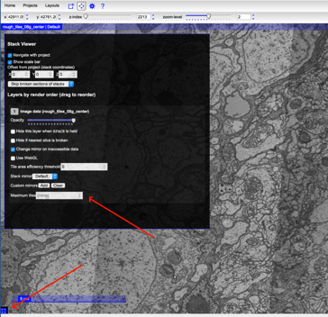

# Dynamic Rendering
CATMAID supports dynamic rendering of `render-ws` project stacks meaning a user can quickly and seamlessly view image stacks loaded in `render-ws` without first having to export image to disk. Dynamic rendering is really only suitable as a staging area during alignments. Once your data is nicely aligned, the data still must be tiled and saved to disk.

From Eric Trautman at Janelia:
> At Janelia, we use the dynamic rendering integration while refining alignments and then “materialize” final alignments to disk for tracing. The key caveat is that although dynamic rendering works, it can be slow – particularly when viewing zoomed-out views of thousands of tiles. We work around this limitation by rendering just the bounding boxes of tiles in zoomed-out views and only render tile content once you have zoomed-in to a smaller area.

## How-to
Connect to a machine that has Docker other than the machine running `render-ws`. Create the following Dockerfile and save it as `Dockerfile` (no extension) in a convenient location.
```Dockerfile
FROM trautmane/catmaid:aaa_dev_render_deploy

RUN sed -i 's/renderer.int.janelia.org:8080/sonic:8080/' /home/django/projects/mysite/settings_base.py
```

Build the image from the directory you have just created the Dockerfile in. We will tag it with `tudelft`.
```
$ docker build -t catmaid-render:tudelft ~/path/to/Dockerfile
```

Run a container based on the newly created image
```
$ docker run -it -p 8000:80 --rm catmaid-render:tudelft standalone
```

---
## Original Instructions from Eric Trautman

Assuming you have Docker running...

#### 1 Build Docker Image
Build a variant of the CATMAID image I use for Janelia that references your render instance instead of mine (note you’ll need 4GB of storage available for the docker images – the CATMAID devs have not tried to slim down their image yet)

1. Save the attached Dockerfile on the machine where you are running docker.
2. Edit the Dockerfile and change ‘ryan-render’ to the real DNS name (or IP address) of your render server.
3. Build your custom image
```
docker build -t catmaid-render:ryan .
```

#### 2 Run Docker Container
Run a container based upon your image
```
docker run -it -p 8000:80 --rm catmaid-render:ryan standalone
```

#### 3 Go to CATMAID on Docker Server
In your browser, go to http://localhost:8000  (or whatever the hostname is where you are running docker). You should see the CATMAID home page with projects and stacks dynamically listed based upon the data from your render web service. You can use the project/stack filter UI or the ‘Projects’ menu option to locate your desired stack and then simply click on it to view it.

### Some Things to Keep in Mind
Some things to keep in mind about this dynamic render version of CATMAID

1. Although the CATMAID host is running Postgres, you are not really using that database.  The project and stack data is being ‘proxied’ from your render web service.  This means you don’t have to worry about administering stacks in CATMAID, they simply become available whenever you complete them in render.  It also means that you should limit your use of this CATMAID instance to viewing – no tracing, annotating, etc.  I’m not sure what would happen if you did write stack data to CATMAID’s database, but it’s not something we intended to support with this integration.

2. As I mentioned earlier, dynamic rendering of large numbers of tiles with large numbers of transformations in zoomed-out views can be slow.  We work around this limitation by rendering bounding boxes when more than 40 tiles are requested.  You can explicitly change this maximum in CATMAID by clicking on the ‘show layer controls’ widget and then setting the ‘Maximum tiles’ value. You can also change the default maximum from 40 to something else in the render web service configuration if you find yourself needing to manually edit the value in CATMAID too often.
 

3. Your render web service instance needs to have enough RAM and CPUs to handle the number of concurrent dynamic rendering requests it will receive.  At Janelia, we typically only have one or two aligners viewing dynamically rendered stacks at any given time so I run one CATMAID docker instance on a 2 core, 4GB RAM VM and connect it to one render web services instance running on a 4 core, 16GB RAM VM and that seems to work well enough.  If I need to handle higher usage, I can set up dedicated instances for particular users.  When I materialize final alignments to disk for tracing, I use cluster distributed ‘client-side’ render software to do the rendering and only use the centralized web services for metadata retrieval.


### Manual Setup
Finally if you prefer to manually setup your own CATMAID instance instead of using Docker, the key steps are:

1. Build from the dev branch (Tom Kazimiers has not merged our latest integration stuff to the master branch yet – should happen in the next month or so) and

2. Add the render middleware settings from this commit  (with your render host instead of mine):
https://github.com/trautmane/CATMAID/commit/1e1ef408697d341572c59b066679f5977cefa642

Note that the render stack tile width and height are for the requests from CATMAID and do not need to match the size of your source tiles.  I’ve found the 1024x1024 boxes work well, so I would not recommend changing those values.
